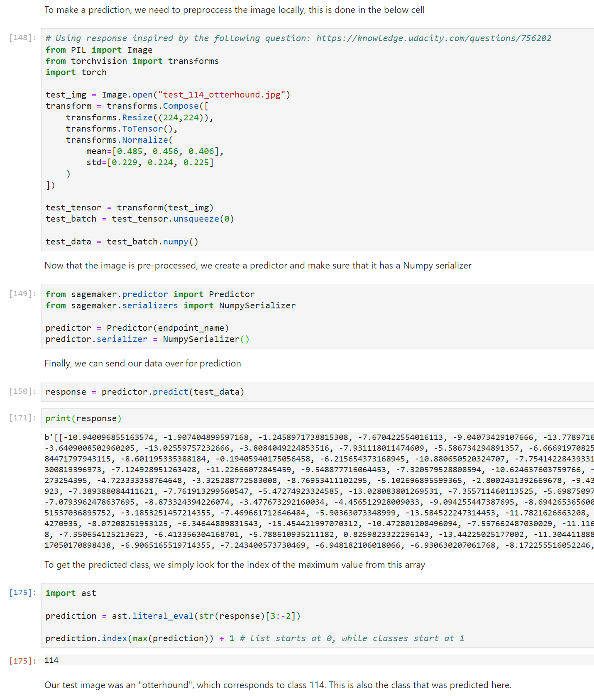

# Image Classification using AWS SageMaker

*Use AWS Sagemaker to train a pretrained model that can perform image classification by using the Sagemaker profiling, debugger, hyperparameter tuning and other good ML engineering practices. This can be done on either the provided dog breed classication data set or one of your choice.*

This project classifies 133 dog breeds. This is achieved by finetuning a resnet18 model and optimizing its hyperparameters.

## Project Set Up and Installation
*Enter AWS through the gateway in the course and open SageMaker Studio. 
Download the starter files.
Download/Make the dataset available. *

## Dataset
*The provided dataset is the dogbreed classification dataset which can be found in the classroom.
The project is designed to be dataset independent so if there is a dataset that is more interesting or relevant to your work, you are welcome to use it to complete the project.*

The dataset used is the dogbreed classification dataset. This dataset contains images on 133 different dog breeds.

### Access
*Upload the data to an S3 bucket through the AWS Gateway so that SageMaker has access to the data. *

## Hyperparameter Tuning
*What kind of model did you choose for this experiment and why? Give an overview of the types of parameters and their ranges used for the hyperparameter search*

The resnet18 model was used for this assignment. This is a pre-trained CNN model so it should be well-suited for the task of image classification. Through the exercises, this model was also already familiar.

For this experiment three hyperparameters were tuned:

```python
hyperparameter_ranges = {
    "lr": ContinuousParameter(0.001, 0.1),
    "batch-size": CategoricalParameter([32, 64, 128, 256, 512]),
    "epochs": IntegerParameter(2, 5)
}
```

- Different learning rates allow to find the best trade-off between being unable to learn (too small) and being too unstable (too big)
- Different batch sizes allow to find the model that makes the best trade-off between the increased speed from large batches and backpropagating on small batches
- Different epochs allow to find the model that has the best trade-off between training a lot of cycles (many epochs) and the time savings from having few epochs

Below are some screenshots of the hyperparameter tuning:


Here are also screenshots of 2 of the training jobs from this tuning.

JOB 1 (the best model):


JOB 2:


## Debugging and Profiling
*Give an overview of how you performed model debugging and profiling in Sagemaker*

Profiling & debugging was performed by tracking some basic rules when training the model:

```python
# TODO: Set up debugging and profiling rules and hooks

from sagemaker.debugger import Rule, ProfilerRule, rule_configs
from sagemaker.debugger import DebuggerHookConfig, ProfilerConfig, FrameworkProfile, CollectionConfig

rules = [
    Rule.sagemaker(rule_configs.loss_not_decreasing()),
    ProfilerRule.sagemaker(rule_configs.LowGPUUtilization()),
    ProfilerRule.sagemaker(rule_configs.ProfilerReport()),
    Rule.sagemaker(rule_configs.vanishing_gradient()),
    Rule.sagemaker(rule_configs.overfit()),
    Rule.sagemaker(rule_configs.overtraining()),
    Rule.sagemaker(rule_configs.poor_weight_initialization()),
]

profiler_config = ProfilerConfig(
    framework_profile_params=FrameworkProfile()
)

# Using fix from course forum (https://knowledge.udacity.com/questions/808539)
# Create collection config so that debugger tracks loss value
collection_configs=[
    CollectionConfig(
        name="CrossEntropyLoss_output_0", 
        parameters={
            "include_regex": "CrossEntropyLoss_output_0", 
            "train.save_interval": "1",
            "eval.save_interval": "1"
        }
    )
]

debugger_config = DebuggerHookConfig(
    hook_parameters={"train.save_interval": "1", "eval.save_interval": "1"},
    collection_configs=collection_configs
)
```

The main goal of the debugging here was to visualize the cross entropy loss during the training/evaluation. The output chart of this can be found in the `train_and_deploy.ipynb` notebook.

For the resource utilization, the profiler report can be consulted.

### Results
*What are the results/insights did you get by profiling/debugging your model?*

**Debugging**: The validation loss does not really show any trend. It is neither really decreasing, nor increasing. However, the training loss is clearly decreasing rapidly. One cause of this might be that the model is overfitting on the training data. To resolve this, we could try to apply the hyperparameter tuning again, but this time with smaller learning rates. For instance, instead of using the range `ContinuousParameter(0.001, 0.1)` for the learning rate, we could use `ContinuousParameter(0.00001, 0.001)`. Since we have a lower learning rate, we might also need to increase the number of epochs to ensure convergence. (Due to a limited number of available credits on AWS, this step was not actually implemented)

*Remember to provide the profiler html/pdf file in your submission.*

See the `profiler_report.zip` file


## Model Deployment
*Give an overview of the deployed model and instructions on how to query the endpoint with a sample input.*

The model seems to perform decently well, given that it is a very basic model. The validation accuracy was recorded at 78%.

The below code shows a brief example of how to set up an endpoint and make a prediction with the model that was created. The `endpoint_name` variable should contain a string that holds the name of the endpoint where this model was deployed to. The `test_114_otterhound.jpg` file was just one of the many test files from the dog-breed dataset.



*Remember to provide a screenshot of the deployed active endpoint in Sagemaker.*

**Screenshot of the deployed active endpoint:**


## Standout Suggestions
**TODO (Optional):** This is where you can provide information about any standout suggestions that you have attempted.
